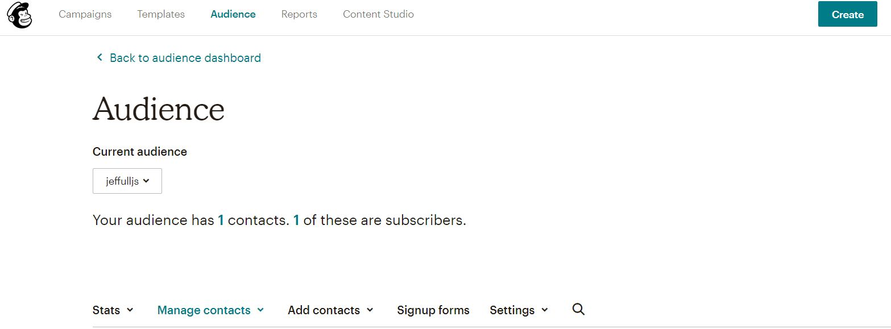
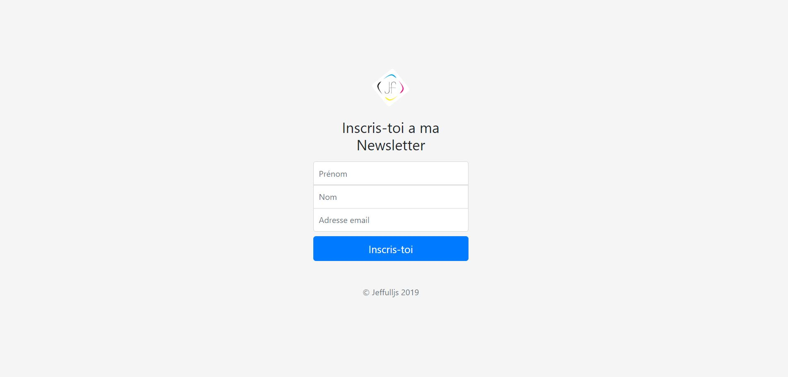

# Newsletter

Création d'une Newsletter avec l'api Mailchimp en node js 

## Pour commencer

Il suffit d'aller a cette adresse [JeffullJS](https://jeffulljs.herokuapp.com/) pour faire une demande à la newsletter ceux-ci est un projet fictif je n'est pas de contenus a la newletter cependant le parametrage de l'api mailchimp est bien réel.

En effet, Mailchimp permet d'organiser des campagnes de newsletter ou d'emailling.

## Technos utlisés

* HTML
* CSS
* NPM
* NODE JS
* Express js
* APi Mailchimp
* Heroku

